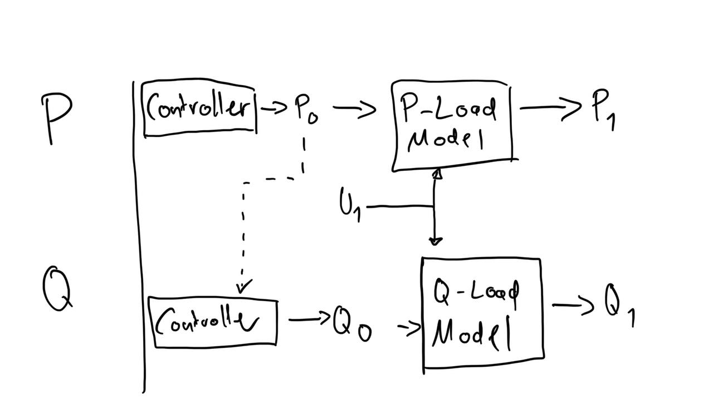

# IEEH Power System Data Model

[](https://opensource.org/licenses/BSD-3-Clause)

A data model for the description of electrical power systems.

- [IEEH Power System Data Model](#ieeh-power-system-data-model)
  - [ Field of Application](#-field-of-application)
  - [ General Remarks](#-general-remarks)
  - [ Installation](#-installation)
  - [ Development](#-development)
  - [ Attribution](#-attribution)

## <div id="application" /> Field of Application

This data model is intended to describe electrical power systems. It provides a hierarchical structure/schema to describe unique entity relations as well as parameter sets.

The data model is structured as the following schema:

- grid topology:
  - base topology containing all elements of the exported grid
- topology case;
  - information about disabled elements to represent a specific operational case based on the base topology
- steadystate case
  - information about power draw/infeed for a specific operational case
## <div id="remarks" /> General Remarks

Please find below some important general remarks and assumptions to consider for consistent usage across different applications:
- The passive sign convention should be used for all types of loads (consumer as well as producer).
- Numeric values should be set using the SI unit convention.
- Topology
  - The `Rated Power` should always be defined positive (absolute value).
- SteadyState
  -The interaction between load models and controllers are depicted in the following schematic:
  

## <div id="installation" /> Installation

Just install via pip:

```bash
pip install ieeh-power-system-data-model
```

## <div id="development" /> Development

Install [pdm](https://github.com/pdm-project/pdm)

Windows:

```bash
(Invoke-WebRequest -Uri https://raw.githubusercontent.com/pdm-project/pdm/main/install-pdm.py -UseBasicParsing).Content | python -
```

Linux/Mac:

```bash
curl -sSL https://raw.githubusercontent.com/pdm-project/pdm/main/install-pdm.py | python3 -
```

Or using pipx or pip:
```bash
pipx install pdm
```
```bash
pip install --user pdm
```

Clone `power-system-data-model`

```bash
git@github.com:ieeh-tu-dresden/power-system-data-model.git
```

```bash
cd power-system-data-model
```

Install `power-system-data-model` as a production tool

```bash
pdm install --prod
```

Install `power-system-data-model` in development mode

```bash
pdm install
```

For development in [Visual Studio Code](https://github.com/microsoft/vscode), all configurations are already provided:

- [ruff](https://github.com/astral-sh/ruff)
- [black](https://github.com/psf/black)
- [mypy](https://github.com/python/mypy)

## <div id="attribution" /> Attribution

Please provide a link to this repository:

<https://github.com/ieeh-tu-dresden/power-system-data-model>

Please cite as:

Institute of Electrical Power Systems and High Voltage Engineering - TU Dresden, _Power System Data Model - A data model for the description of electrical power systems_, Zenodo, 2023. <https://doi.org/10.5281/zenodo.8087079>.

[](https://doi.org/10.5281/zenodo.8087079)
